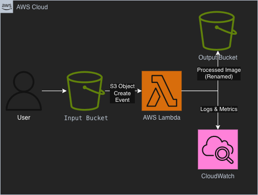

# Serverless Image Processing Pipeline on AWS

## Overview

This project implements a **serverless, event-driven image processing pipeline** on AWS.  
When an image is uploaded to an Amazon S3 input bucket, an AWS Lambda function is automatically triggered to process the image and store the result in an output bucket.

The project is designed to demonstrate:
- Serverless architecture principles
- Event-driven workflows using Amazon S3 and AWS Lambda
- IAM least-privilege permissions
- Observability using Amazon CloudWatch
- Cost-efficient, scalable design aligned with **AWS SAA-C03 concepts**

---

## Architecture

**High-level flow:**

User → S3 (Input Bucket) → AWS Lambda → S3 (Output Bucket)  
                                     ↳ CloudWatch (Logs & Metrics)

📌 **Architecture Diagram**

---

## Repository Structure

---

## What Was Built

- Private Amazon S3 input and output buckets  
- Event notification on input bucket (`ObjectCreated`)  
- AWS Lambda function (Python 3.12)  
- IAM execution role with least-privilege permissions  
- CloudWatch Logs for observability  
- End-to-end validation of event-driven processing  

---

## Validation Checklist

- Image upload to input S3 bucket triggers Lambda execution  
- Processed image appears automatically in output bucket  
- Lambda execution visible in CloudWatch Logs  
- IAM role scoped only to required S3 and logging actions  
- No public access enabled on any S3 bucket  

---

## Documentation

- 📘 **Build Steps:** [howto.md](./howto.md)  
- 🧹 **Cleanup Guide:** [cleanup.md](./cleanup.md)  
- 💰 **Cost Estimate:** [cost-estimate.md](./cost-estimate.md)  

---

## Cost Note

This project is designed to remain within the **AWS Free Tier** when tested responsibly.

- Amazon S3: Minimal storage and request costs  
- AWS Lambda: Free Tier eligible (1M requests/month)  
- CloudWatch Logs: Minimal log ingestion  

Estimated cost if left running: **$0.00 – $1.00/month**

---

## Skills Demonstrated

- Serverless architecture design  
- Event-driven systems on AWS  
- IAM least-privilege security  
- Observability and logging  
- Cost-aware cloud engineering  

---

## Contact

**Raghu Vikas Reddy Yadavalli**

- LinkedIn: https://www.linkedin.com/in/raghu-vikas-reddy-yadavalli-3b23a41ab/  
- Email: reddy.vikas8987@gmail.com

