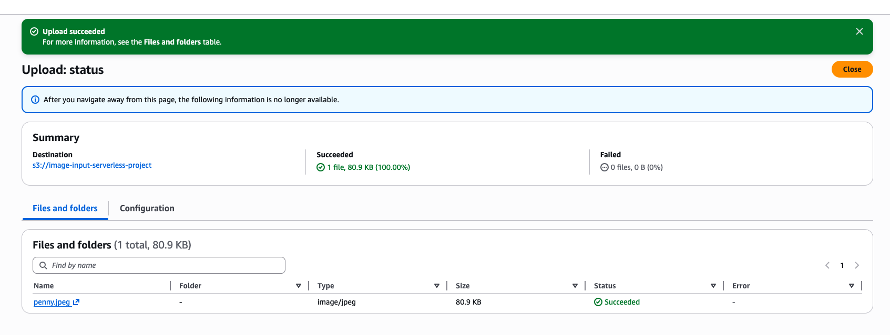
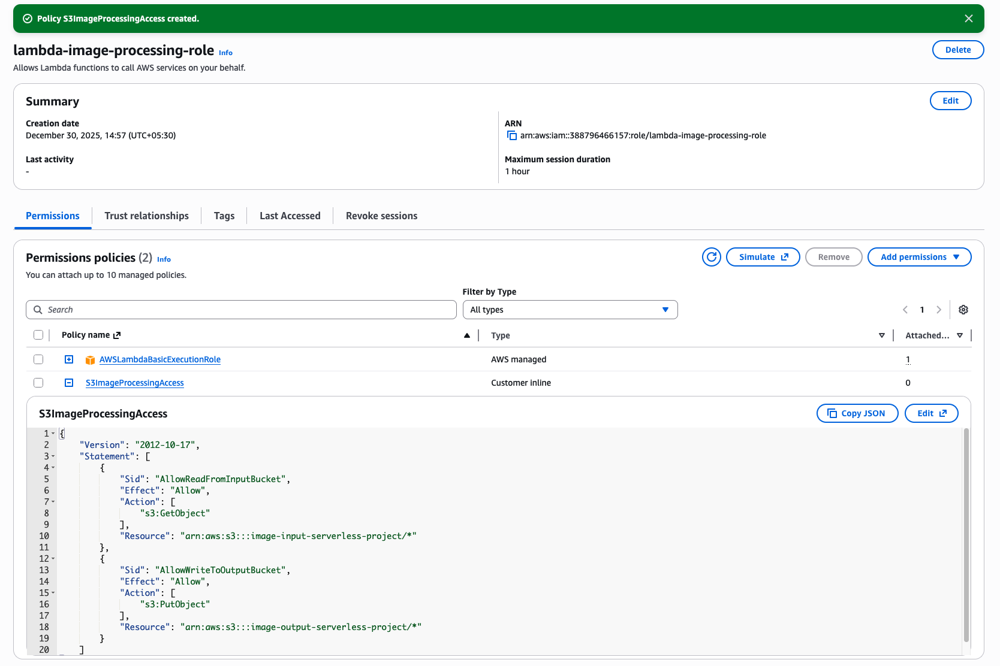
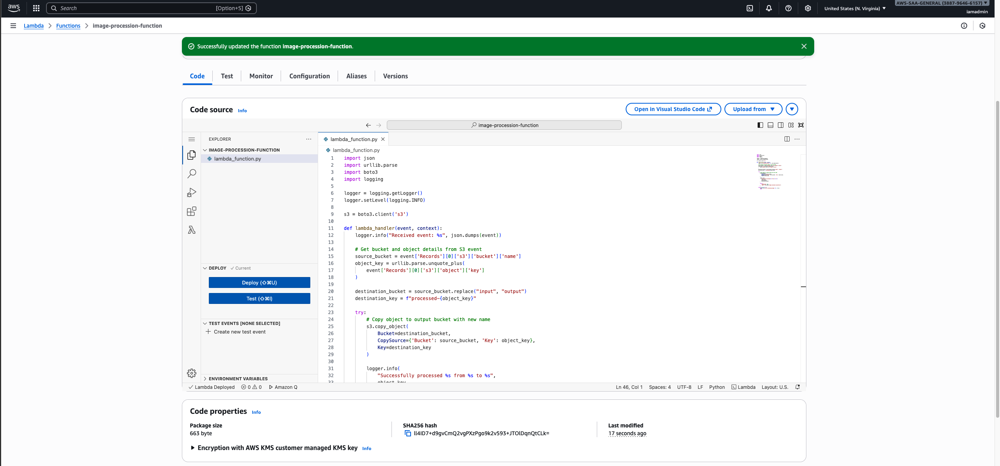
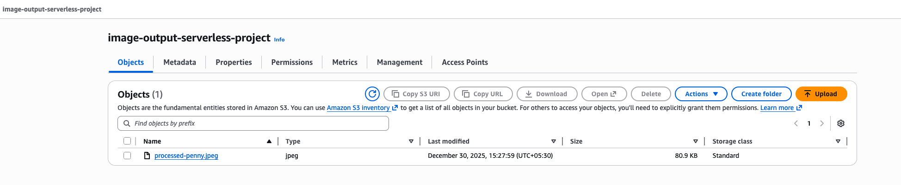
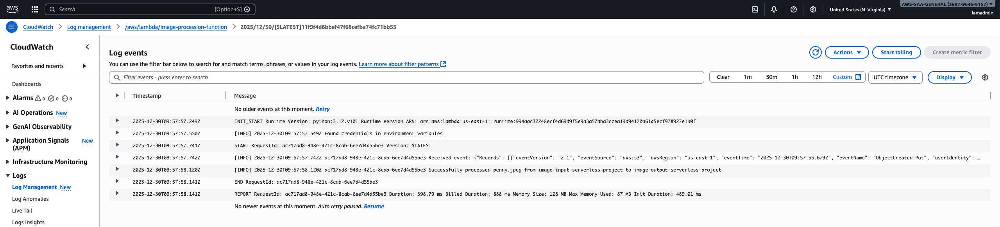

# Build & Implementation Guide

This document provides a step-by-step walkthrough of how this serverless image processing pipeline was built.

---

## Phase 1 – S3 Buckets

### Create Input Bucket
- Created a private S3 bucket to receive image uploads
- Public access blocked to maintain security

### Upload Test Image
- Uploaded a sample image to trigger the pipeline

---

## Phase 2 – IAM Role

### Lambda Execution Role
- Created a dedicated IAM role for Lambda
- Attached AWSLambdaBasicExecutionRole for logging
- Added inline policy for least-privilege S3 access

---

## Phase 3 – Lambda Function

### Function Creation
- Created Lambda function using Python 3.12
- Attached existing IAM role

### Lambda Code
- Reads image from input bucket
- Copies image to output bucket with new name
- Logs execution details

---

## Phase 4 – Testing & Verification

### Output Bucket Verification
- Processed image appears automatically in output bucket

### CloudWatch Logs
- Verified successful Lambda execution via logs

